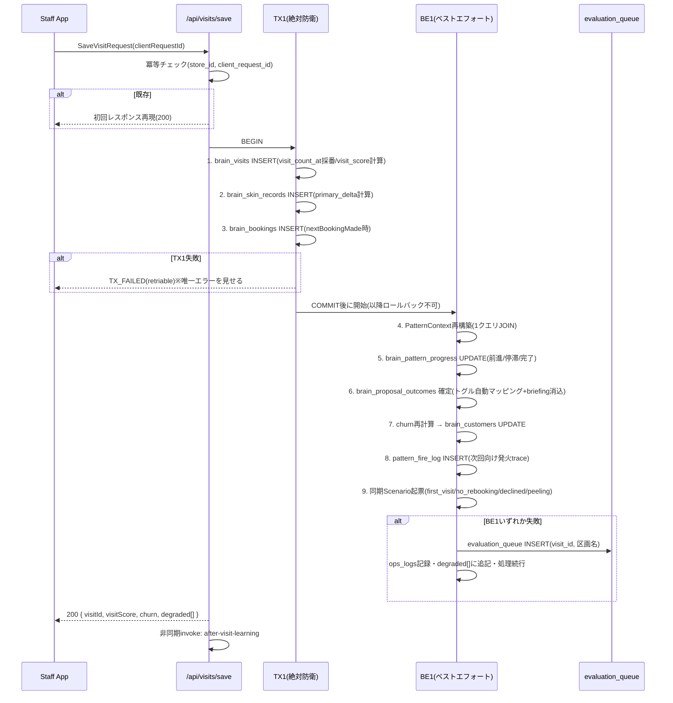
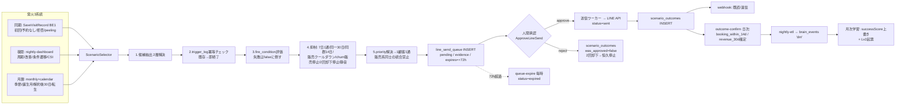
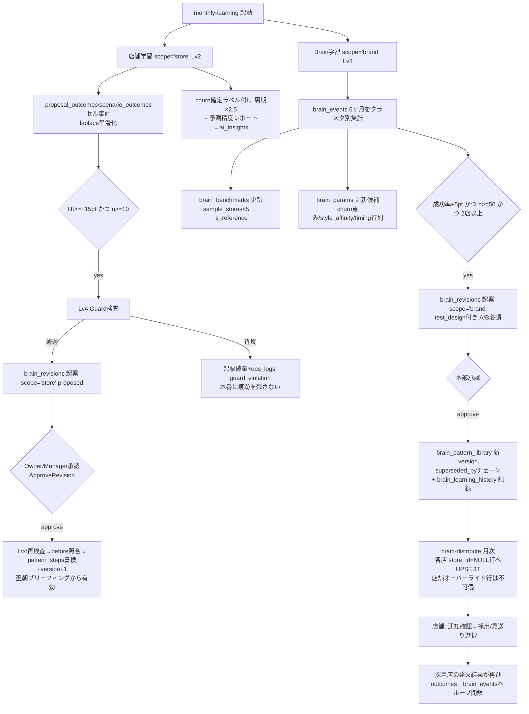
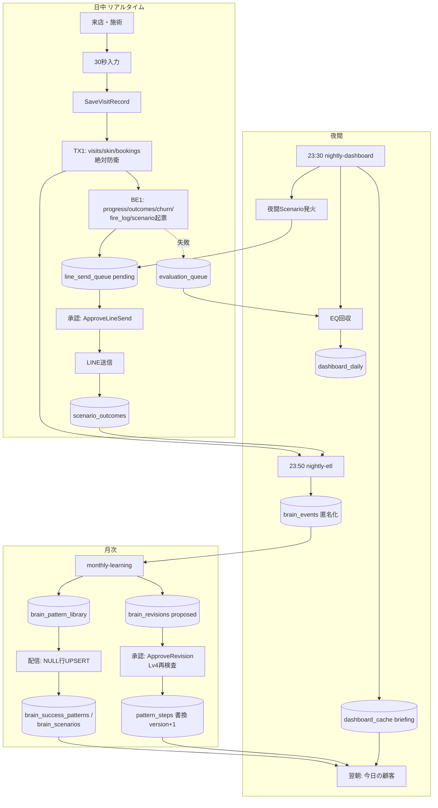

# Riora Event Flow Architecture v1.0

**株式会社martylabo / Salon Riora — Riora OS イベントフロー確定版**
作成日: 2026-06-11
正典関係: Database Master Schema v1.0 / API Architecture v1.0 / P0 API Schema v1.0 と並ぶ正典。**イベントの発生順序・トランザクション境界・障害時挙動に矛盾があれば本書を正とする。**

---

## 0. イベント体系の全体像

Riora OSのイベントは4つの時間軸で動く。

| 時間軸 | トリガ | 主要処理 |
|---|---|---|
| リアルタイム | スタッフの保存タップ | TX1(事実保存)+BE1(エンジン評価)+同期Scenario起票 |
| 夜間(23:30/23:50) | cron | 再評価回収→集計→ブリーフィング→DM発火→ETL |
| 日次・毎時 | cron | queue-expire(毎時)/outcome-confirm(日次) |
| 月次(1日02:00) | cron | 店舗学習(Lv2起票)→Brain学習(Lv3起票)→配信 |

不変原則(全フロー共通):
1. **店舗のリアルタイム動作はBrainに依存しない**(Brain全停止でも店は完全動作)
2. **書込の正面玄関は3つ**: SaveVisitRecord / ApproveRevision / ApproveLineSend
3. **発火基準の変更は翌朝から有効**(施術中にルールが変わらない)
4. **失敗は飲み込んで回収する**(Silent Error UX・6章)

---

# 1. リアルタイムフロー(来店入力→保存→評価)

```
お見送り直後・スタッフが1画面入力(30秒)
 → POST /api/visits/save(clientRequestId付き)
 → 冪等チェック: 同一IDなら初回レスポンス再現で即200
 → TX1実行(2章) → BE1実行(2章) → レスポンス返却(degraded[]付き)
 → 非同期: after-visit-learning(音声メモ構造化)
```

UI体感の確定値: TX1+BE1合計でp95 < 1.5秒を目標。BE1が重い場合はBE1全体を非同期化してよい(その場合レスポンスのpatternAdvanced/nextVisitProposalsはnull許容に落とす — 実装時の性能実測で判断し、判断結果は本書改版に記録)。

# 2. SaveVisitRecord 内部処理順(確定)



**dashboard_dailyへの書込はこのフローに存在しない**(夜間バッチ専管)。当日売上はGET /api/dashboard/topの軽量COUNTが補完する。

# 3. 夜間バッチフロー(23:30 nightly-dashboard → 23:50 nightly-etl)

```mermaid
flowchart TD
    A[23:30 nightly-dashboard 起動] --> B[0. evaluation_queue 回収<br/>未resolved全件を再評価<br/>3回失敗→ops_logs昇格+ai_insights要確認]
    B --> C[1. 状態再計算<br/>全顧客: churn / cycle_ratio / subsc_conditions / stalled]
    C --> D[2. dashboard_daily 生成<br/>月売上/着地予測/損益分岐/funnel/segment/staff_matrix<br/>→ (store_id, snapshot_date) UPSERT]
    D --> E[3. ai_insights 生成<br/>Phase1: ルールベース3行 / Phase2: Claude API]
    E --> F[4. ブリーフィング生成<br/>翌日bookings×ProposalGenerator×ScriptComposer<br/>→ dashboard_cache kind='briefing']
    F --> G[5. 夜間Scenario発火<br/>cycle_over_* / skin_improved / subsc_cond_* /<br/>pace_drop / CSI / e1_milestone]
    G --> H[ScenarioSelector 5段<br/>→ scenario_trigger_log + line_send_queue pending]
    H --> I[23:50 nightly-etl 起動]
    I --> J[匿名化変換: hash/band/style/日付化<br/>consent=false除外]
    J --> K[brain_events 冪等UPSERT<br/>+ ops_logs kind='etl' 件数記録]
    K --> L[完了。失敗区画は前回キャッシュ温存<br/>+ ops_logs kind='batch_error']
```

順序の理由: ①回収を最初に行う(その日のBE1失敗分を当日中に正す)→ ②状態再計算が ③④⑤の入力になる → ETLは全確定後(23:50)に分離起動(dashboard失敗がETLを道連れにしない)。

# 4. Scenario発火フロー(発火→承認→送信→学習)



# 5. 月次Brain学習フロー(毎月1日 02:00)



# 6. Silent Error UX(エラークラスと挙動の確定)

| クラス | 発生箇所 | 保存するもの | 捨てるもの | 誰に・いつ見せるか |
|---|---|---|---|---|
| BLOCKING | TX1のみ | なし(全ロールバック・clientRequestIdで再送可) | なし | **スタッフに即時**(唯一の例外)「保存できませんでした。もう一度タップ」+下書き保持 |
| DEGRADED | BE1各区画 | TX1確定分+evaluation_queue+ops_logs | その場の評価結果(夜間再生成) | 誰にも見せない(degraded[]はログ) |
| SILENT | 夜間/日次バッチ | 前回成功キャッシュ温存+ops_logs | 当回生成物 | UIはisStale:trueで前回分表示。管理者には翌朝ai_insightsで集約 |
| GUARD | Lv4違反/NG文面 | ops_logs(diff全文) | 起票・文面そのもの | 月次集計のみ(insightsにguard件数) |
| EXPIRE | line_send_queue 72h | expired履歴(cooldown入力) | 送信 | 承認画面から自動消滅 |

鉄則: **エラーを見るのは管理者、それも翌朝まとめて。スタッフが見るエラーはTX1失敗の1種類だけ。**

# 7. 障害時フォールバック(コンポーネント別)

| 障害 | 影響 | フォールバック | 復旧時 |
|---|---|---|---|
| BE1恒常失敗(エンジンバグ等) | 提案・churnが更新されない | TX1は通り続ける(入力は無傷)。evaluation_queue滞留→3回失敗でai_insights「要確認」 | 修正デプロイ後、夜間回収が自動消化 |
| nightly-dashboard失敗 | 翌朝ブリーフィング・KPI欠落 | dashboard_cache/dashboard_dailyは前日分温存+isStale。Scenario夜間発火はその回スキップ(翌晩に周期系は再評価されるため取りこぼし最小) | 手動再実行可(冪等UPSERT) |
| nightly-etl失敗 | brain_events欠落 | 店舗運用に影響ゼロ。差分は翌晩まとめ再送(冪等キー) | 自動 |
| monthly-learning失敗 | 起票されない | 学習が1ヶ月遅れるだけ。発火基準は現行版継続 | 翌月 or 手動再実行 |
| Brain全停止 | 配信・ベンチマーク停止 | 店舗は現行version で完全動作(不変原則1) | 再開後の月次syncで追従 |
| LINE API障害 | 送信failed | status='failed'保持→送信ワーカーが指数バックオフ3回→expires_atで自然expired | 自動 |
| 承認者不在(承認滞留) | pending滞留 | 72hでexpired(古いフォローは送らない方が正しい)。periodically ai_insightsに滞留件数表示 | — |
| Supabase障害(保存不能) | TX1失敗 | UIローカル下書き保持+clientRequestIdで復旧後再送 | 再送で冪等成立 |

# 8. 統合Mermaid図(1日の全体像)



---

## 9. チェックリスト(本書が定義を確定した7点)

| 項目 | 確定内容 |
|---|---|
| TX1(絶対防衛) | visits→skin_records→bookings の3書込のみ。失敗=全ロールバック・唯一ユーザーに見せるエラー |
| BE1(ベストエフォート) | progress→outcomes→churn→fire_log→scenario起票 の5区画。各区画独立try・TX1を巻き戻さない |
| evaluation_queue回収 | 夜間バッチ冒頭で全件再評価。3回失敗でops_logs昇格+ai_insights「要確認」 |
| line_send_queue生成 | 同期(BE1区画9)・夜間(発火系統B)・月暦(系統C)の3経路のみ。全てScenarioSelector経由・pending起票・人間承認 |
| dashboard_daily生成 | 23:30バッチ専管・(store_id, snapshot_date) UPSERT。リアルタイム書込禁止 |
| brain_events生成 | 23:50 nightly-etlの1箇所のみ。hash/band/style/日付化・同意false除外・冪等UPSERT |
| revision起票 | 月次バッチのみ(scope='store'/'brand')。起票前Lv4 Guard・承認時Lv4再検査の二重。反映は翌朝から |

---
*Riora Event Flow Architecture v1.0 — イベントフロー定義の唯一の正とする。*
