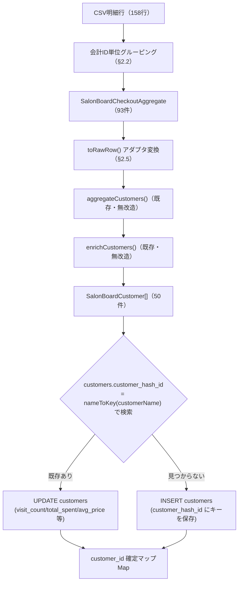
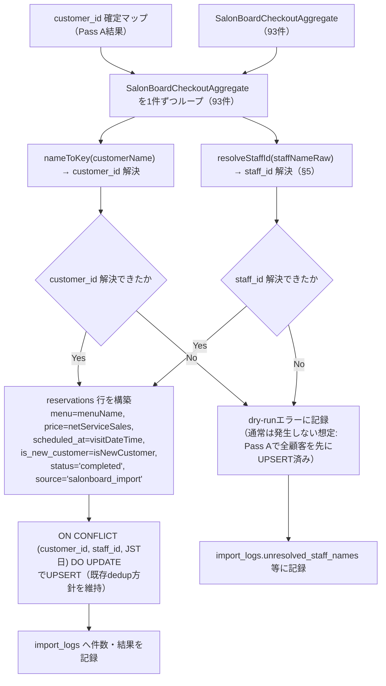

# SalonBoard売上明細CSV実装準備設計（会計ID集約・Pass A/B・staff_id解決・dry-run）

> **⚠️ SUPERSEDED (2026-06-20)**: `reservations`/`profiles`/`staff_name_aliases`前提の旧設計。`brain_*`方針確定により**廃止**。会計ID集約ロジック(§2)自体は再利用可能だが、保存先は`brain_visits`/`brain_staff`に置き換えて再設計が必要。本書は経緯記録としてのみ残置。

- 作成日: 2026-06-19
- 位置づけ: **実装準備の設計のみ**。コード変更・本番DBへのmigration適用は行わない。
- 解析対象: `test-data/csv-import/salonboard_demo_sales_50customers.csv`（50顧客・158明細行・93会計）
- 基準ドキュメント: `docs/CSV_IMPORT_FINAL_ARCHITECTURE.md`、`docs/CSV_IMPORT_PHASE1_DESIGN.md`、`docs/CSV_IMPORT_NAME_MATCHING_DESIGN.md`、`docs/DB_AUDIT_REPORT.md`

---

## 0. 結論サマリ（重要な前提の更新）

`docs/CSV_IMPORT_FINAL_ARCHITECTURE.md` §6は「`salonBoardParser.ts`は変更不要・再利用率95%」としていたが、これは**集計済み・1行=1来店のCSV**を前提にした評価だった。実際のSalonBoard「売上明細」CSV（本書で解析した実データ形式）は**1行=1明細項目（会計IDで複数行が1来店にまとまる）**という全く異なる粒度であり、現行`salonBoardParser.ts`の列名マッピング（`COLUMN_ALIASES`）はこの形式の列を一つも検出できない。

→ 現行パーサーをそのまま使うことはできず、**「明細行→来店単位への集約」を行う新しい前処理ステップ**が必須になる。本書はこの前処理ステップの設計を中心に、Pass A/B全体への影響を整理する。既存`aggregateCustomers()`/`enrichCustomers()`自体（顧客単位への集約以降のロジック）は変更せず再利用できる（§2.5）。

---

## 1. 実データCSV解析結果

`test-data/csv-import/generate-demo-csv.js`が生成したファイルを実際に集計し、以下を確認した（検証スクリプトの実行結果に基づく）。

| 項目 | 値 |
|---|---|
| 総行数 | 158行（明細行） |
| 会計ID数（来店数相当） | 93件 |
| 顧客数（お客様名ユニーク） | 50名 |
| 性別 | 女性46名・男性4名 |
| 新規/再来 | 新規50件・再来43件（会計単位） |
| 指名あり/なし | あり21件・なし72件（会計単位） |
| スタッフ別行数 | 田中81・鈴木50・久保田27（明細行単位） |
| 予約経路 | HOT PEPPER・店頭・紹介・LINE・電話の5種類すべて出現 |
| 区分別行数 | メニュー93・オプション33・店販15・割引11・サービス6 |
| ジャンル値 | フェイシャル・店販・オプション・割引・サービス |
| 単価区分値 | 通常・クーポン・会員価格・セット |
| 単価の範囲 | -2,000円（割引）〜19,800円（メニュー最高額） |
| お客様番号 | 全158行で空欄 |

追加で構造的な前提を検証した（同一会計ID内の整合性チェック）:

| 検証項目 | 結果 |
|---|---|
| 同一会計IDに区分=メニューの行が複数/0件 | **0件**（全93会計で常に1件） |
| 同一会計ID内でお客様名が複数値 | **0件** |
| 同一会計ID内でスタッフが複数値 | **0件** |
| 同一会計ID内で会計日+会計時間が複数値 | **0件** |

これらは本デモデータが「1会計＝1人の顧客・1人のスタッフ・1つの来店時刻」という前提で生成されているために整合しているが、**実際のSalonBoard出力でこの前提が常に成り立つかは未確認**（本書のスコープ外）。§6のdry-runエラー一覧では、この前提が崩れているCSVが来た場合の検出ルールも含める。

---

## 2. 会計ID単位の集約ロジック設計

### 2.1 入力

CSVをパースした明細行（新規型、現行`SalonBoardRawRow`とは別物。実装時に新設が必要）:

```ts
interface SalonBoardDetailRow {
  checkoutDate:   string   // 会計日 (YYYY/MM/DD → YYYY-MM-DD に正規化)
  checkoutTime:   string   // 会計時間 (HH:MM)
  checkoutId:     string   // 会計ID
  checkoutType:   string   // 会計区分（通常 等）
  category:       string   // 区分（メニュー/オプション/店販/割引/サービス）
  genre:          string   // ジャンル
  subCategory:    string   // カテゴリ
  itemName:       string   // メニュー・店販・割引・サービス・オプション列
  unitPrice:      number   // 単価
  priceType:      string   // 単価区分
  quantity:       number   // 個数
  amount:         number   // 金額
  staffNameRaw:   string   // スタッフ（生テキスト）
  isDesignatedRaw: string  // 指名（あり/なし）
  customerName:   string   // お客様名
  customerNumber: string   // お客様番号（常に空欄）
  customerKana:   string   // お客様名（フリガナ）
  bookingChannel: string   // 予約経路
  gender:         string   // 性別
  newOrRepeat:    string   // 新規再来
}
```

### 2.2 集約単位とアルゴリズム

`checkoutId`でグルーピングし、グループ内の行を以下のルールで1件の「来店集約」に変換する。

1. **ヘッダ情報の抽出**: グループ内の1行目から`customerName`/`customerKana`/`gender`/`staffNameRaw`/`isDesignatedRaw`/`bookingChannel`/`newOrRepeat`/`checkoutDate`/`checkoutTime`を取得する。**グループ内で値が割れていないことを検証する**（§6のdry-runエラー「会計ID内の客情報不一致」「スタッフ不一致」に対応）。
2. **区分別の分類**:
   - `区分='メニュー'`の行: ちょうど1件であることを期待する（§6で検証）。`menuName = itemName`。
   - `区分='オプション'`の行: 0件以上。`optionNames = itemName[]`。
   - `区分='店販'`の行: 0件以上。`retailNames = itemName[]`、`retailSales = Σamount`。
   - `区分='割引'`の行: 0件以上。`discountTotal = Σamount`（負数）。
   - `区分='サービス'`の行: 0件以上。`serviceNames = itemName[]`（通常`amount=0`）。
   - 上記5種類以外の`区分`値: 集計対象外とし、dry-runの警告（未知区分）として記録する。
3. **金額の集計**:
   - `netServiceSales = Σamount`（区分が メニュー/オプション/割引/サービス の行。店販を除く施術関連の実質売上。割引は負数のため自動的に差し引かれる）
   - `retailSales = Σamount`（区分='店販'の行のみ）
4. **来店時刻の確定**: `visitDateTime = checkoutDate + 'T' + checkoutTime + ':00+09:00'`（Asia/Tokyo固定のISO8601）。

### 2.3 出力（集約後の型・新設計）

```ts
interface SalonBoardCheckoutAggregate {
  checkoutId:       string
  customerName:     string
  customerKana:     string
  gender:           string
  visitDateTime:    string    // ISO, JST
  staffNameRaw:     string
  isDesignated:     boolean   // isDesignatedRaw === 'あり'
  bookingChannel:   string
  isNewCustomer:    boolean   // newOrRepeat === '新規'
  menuName:         string
  netServiceSales:  number
  retailSales:      number
  discountTotal:    number
  optionNames:      string[]
  retailNames:       string[]
  serviceNames:      string[]
  lineItemCount:    number
}
```

93会計それぞれが1件の`SalonBoardCheckoutAggregate`になる（本デモデータでの検証結果）。

### 2.4 性別・予約経路の取り扱い（既知の保存先ギャップ）

`gender`・`bookingChannel`は集約結果には保持するが、`docs/DB_AUDIT_REPORT.md`確認済みの実DBスキーマには**保存先カラムが存在しない**（`customers.gender`無し、`reservations`/`customers`に予約経路列無し）。本書では集約ロジックの設計までとし、保存先の追加（新規カラム）が必要かどうかはユーザー判断待ちの別タスクとして明記するに留める（migration設計・適用はしない）。

### 2.5 Pass Aへの接続（既存ロジックの再利用）

既存`aggregateCustomers()`（`SalonBoardImportEngine.ts`）は`SalonBoardRawRow`（1行=1来店）を入力とする設計のまま変更しない。`SalonBoardCheckoutAggregate`から変換するアダプタ関数を新設する想定:

```ts
function toRawRow(a: SalonBoardCheckoutAggregate): SalonBoardRawRow {
  return {
    customerName:  a.customerName,
    ageGroup:      undefined,   // 実CSVに無し
    birthMonth:    undefined,   // 実CSVに無し
    visitDate:     a.visitDateTime.slice(0, 10),
    sales:         a.netServiceSales,
    treatment:     a.menuName,
    retailSales:   a.retailSales,
    staffName:     a.staffNameRaw,
    hasNextRebook: false,       // 実CSVに次回予約列が無いため常にfalse（既知の制約。§3で詳述）
    isDesignated:  a.isDesignated,
  }
}
```

この変換を経由させることで、`aggregateCustomers()`/`enrichCustomers()`本体は無改造のまま再利用できる（`docs/CSV_IMPORT_FINAL_ARCHITECTURE.md` §6の再利用方針を維持）。

### 2.6 Pass Bへの接続

`SalonBoardCheckoutAggregate`は1件＝1来店＝1`reservations`行に対応する。Pass A完了後に確定する`customer_id`マップと、§5で解決する`staff_id`を使って直接`reservations`行を構築する（§4で詳述）。

---

## 3. 現行 `salonBoardParser.ts` との差分一覧

| 観点 | 現行実装（`salonBoardParser.ts`/`SalonBoardRawRow`） | 実CSV（本書で解析） | 対応方針 |
|---|---|---|---|
| 行の粒度 | 1行＝1来店 | 1行＝1明細項目（会計IDで複数行が1来店） | §2の集約ステップを前段に追加。現行パーサーは置き換えではなく**前段が必要** |
| 列名 | `顧客名`/`来店日`/`売上`/`施術`/`担当`等（`COLUMN_ALIASES`） | `会計日`/`会計時間`/`会計ID`/`区分`/`ジャンル`/`カテゴリ`/`メニュー・店販・割引・サービス・オプション`/`単価`/`単価区分`/`個数`/`金額`/`スタッフ`/`指名`/`お客様名`/`お客様番号`/`お客様名（フリガナ）`/`予約経路`/`性別`/`新規再来` | 列名がほぼ一致しない。`COLUMN_ALIASES`の拡張だけでは粒度の違いに対応できないため、新規の明細パーサー（§2.1の`SalonBoardDetailRow`）が必要 |
| 来店時刻 | 列が無く、日付のみ | `会計時間`列がある | `scheduled_at`を「来店日+正午固定」（`CSV_IMPORT_FINAL_ARCHITECTURE.md` §4の旧方針）から実際の会計時間ベースに**精度向上できる**。旧方針は撤回候補 |
| 新規/再来判定 | 列が無く、Pass A集計後の`visit_count`から後天的に推定する設計だった | `新規再来`列が直接ある | 一次情報として利用可能。但しDB側の既存`customer_hash_id`に同一顧客がすでに存在するのにCSVが`新規`と主張するケースの優先順位を決める必要（§6で検出対象に追加） |
| 次回予約（`hasNextRebook`） | 列を想定（`COLUMN_ALIASES.hasNextRebook`） | 実CSVに該当列が無い | 常に`false`固定。`rebookCount`/`rebookRate`等のKPIはCSV取込データに対して常に0になる既知の制約として明記（実装時にUI側へその旨を表示するか要検討） |
| 年齢層/誕生月 | 列を想定（`COLUMN_ALIASES.ageGroup`/`birthMonth`） | 実CSVに該当列が無い | 常に`undefined`。両フィールドはオプショナルのため既存ロジックは無改造で動作する |
| 店販売上 | `retailSales`という単一の数値列 | `区分=店販`の複数行を合算する必要がある | §2.2(c)の集約ロジックで対応（現行パーサー単体では対応不可） |
| 施術名（`treatment`） | 単一列からそのまま取得 | `区分=メニュー`の行のみから抽出。オプション/店販/割引/サービスは別系統の情報として扱う必要がある | §2.2(b)で対応。オプション情報は現状`reservations.notes`への転記以外に保存先が無い |
| 性別 | 列が無い | `性別`列がある | `customers.gender`列が実DBに存在しない（`DB_AUDIT_REPORT.md` §1.1）。新規列追加なしでは保存不可。今回はスコープ外として「取得するが保存しない」と明記 |
| 予約経路 | 列が無い | `予約経路`列がある | `reservations`/`customers`いずれにも保存先列が無い。新規列追加の要否はユーザー判断待ちの別タスク（本書ではmigration設計・適用はしない） |
| お客様番号 | 想定されていない（氏名のみで名寄せ） | 列として存在するが全件空欄（実データで確認済み） | `customer_hash_id`は氏名ベースのまま運用する方針を維持（`docs/CSV_IMPORT_NAME_MATCHING_DESIGN.md`） |
| 会計区分 | 列が無い | `通常`等の値が入る列がある | キャンセル等の異常系会計を判別する手がかりになり得るが、本デモは全件`通常`のため実例なし。`通常`以外の値が来た場合の挙動は未設計（§6で警告ルールのみ用意） |

---

## 4. Pass A / Pass B 処理フロー図

### 4.1 Pass A（customers UPSERT）



### 4.2 Pass B（reservations UPSERT）

Pass Bは**Pass A完了後**（全顧客のUPSERTが終わり`customer_id`確定マップが揃った後）に開始する。



**Pass分割を維持する理由**（`CSV_IMPORT_FINAL_ARCHITECTURE.md`の既存方針を継承）: Pass Aは顧客を1名単位に集約するため、Pass Bが要求する「1来店=1行」の粒度とは異なる。生データ起点の`SalonBoardCheckoutAggregate`から直接`reservations`を構築する方が、集約後オブジェクトを逆算するより安全。

---

## 5. staff_id 解決ロジック設計（`staff_name_aliases`活用）

### 5.1 解決フロー

```
CSV「スタッフ」列の生テキスト（例: "久保田"）
   │
   ▼
normalizeStaffName(raw)  ── 既存関数を再利用（全角半角統一・前後空白除去・「スタッフ/担当/先生」サフィックス除去）
   │
   ▼
① profiles.staff_name または display_name と完全一致検索
   │  一致 → profiles.id を確定（解決成功）
   │  不一致 ↓
   ▼
② staff_name_aliases.alias と完全一致検索
   │  一致 → staff_id を確定（解決成功）
   │  不一致 ↓
   ▼
③ 未解決（unresolved）として記録
```

これは`docs/CSV_IMPORT_PHASE1_DESIGN.md` §1.4で設計したフローと同一であり、本書では実データ（`久保田`/`鈴木`/`田中`の3名体制）に適用した場合の具体的な留意点を補足する。

### 5.2 実行時の最適化（インメモリ解決）

`profiles`と`staff_name_aliases`はいずれも小規模テーブルである。インポート実行（dry-run含む）の開始時に両テーブルを1回ずつ全件取得し、以下のMapをメモリ上に構築してから93件のループを処理する（行ごとにDBへ問い合わせない）:

```ts
const profileMap = new Map<string, string>()   // normalize(staff_name|display_name) → profiles.id
const aliasMap   = new Map<string, string>()    // alias → staff_id

function resolveStaffId(raw: string): { staffId: string } | { unresolved: string } {
  const key = normalizeStaffName(raw)
  if (profileMap.has(key)) return { staffId: profileMap.get(key)! }
  if (aliasMap.has(key))   return { staffId: aliasMap.get(key)! }
  return { unresolved: raw }
}
```

### 5.3 事前確認が必要な点（実装着手前のチェックリスト）

- 本番`profiles`テーブルに`久保田`/`鈴木`/`田中`の3名が`staff_name`または`display_name`として実際に登録されているかは**未確認**（本書はテストデータ生成・設計のみのため、実データ照合は行っていない）。実装時の最初のdry-run実行で確認できる。
- 同一スタッフが`profiles`に複数件（例: 退職済み旧アカウントと現アカウント）登録されている場合、`normalizeStaffName()`後の完全一致が複数件にマッチする可能性がある。現状の設計では「0件または複数件＝未解決」としているため、複数件ヒットも dry-run エラーとして検出される（§6）。

### 5.4 alias登録の運用

未解決スタッフ名が検出された場合、運用者（owner）が`staff_name_aliases`へ`(alias, staff_id)`を手動登録する。`staff_name_aliases`は`supabase/migrations/20260619_csv_import_staff_name_aliases.sql`で owner専用RLS（`is_owner()`）かつ`anon`/`authenticated`双方REVOKE済みの設計になっているため、登録操作は`service_role`経由（バックエンドの管理操作）またはPhase2のCSV管理画面（実装時に`authenticated`へのGRANTを追加する想定）からのみ行う。

---

## 6. dry-runで検出すべきエラー一覧

実際の書き込み（Pass A/Pass Bいずれも）を行う前に、CSV全体に対して以下を検証し、`error`が1件でもあればインポート全体を中断する（`docs/CSV_IMPORT_PHASE1_DESIGN.md` §1.5の「全件解決するまで書き込まない」方針を継承・拡張）。

| # | カテゴリ | 検出条件 | 深刻度 | 処理方針 |
|---|---|---|---|---|
| 1 | 必須列欠落 | ヘッダーに`会計ID`/`会計日`/`お客様名`/`スタッフ`/`区分`/`金額`等の必須列が無い | error | 即時中断（1行も処理しない） |
| 2 | メニュー行数異常 | 同一`会計ID`内で`区分=メニュー`の行が0件または2件以上 | error | 該当`会計ID`一覧を記録し中断 |
| 3 | 会計ID内の客情報不一致 | 同一`会計ID`内で`お客様名`/`フリガナ`/`性別`が複数値 | error | 同上 |
| 4 | 会計ID内のスタッフ不一致 | 同一`会計ID`内で`スタッフ`列が複数値 | error | 同上（1来店内で担当が変わるケースの仕様が未確定なため、いったんエラー扱いとし発生時に運用判断） |
| 5 | 会計日時パース失敗 | `会計日`/`会計時間`が日付・時刻として解釈できない | error | 該当行を記録し中断 |
| 6 | 金額の非数値 | `単価`/`個数`/`金額`が数値変換できない | error | 同上 |
| 7 | 金額の不整合 | `単価 × 個数 ≠ 金額`（丸め誤差を超える差） | warn | 記録するが処理継続（`金額`列の値を正として採用） |
| 8 | 顧客名空欄 | `お客様名`が空文字 | error | 該当行をスキップ（既存`salonBoardParser.ts`と同方針） |
| 9 | スタッフ名未解決 | `resolveStaffId()`が解決不能（§5） | error | 未解決名一覧（生テキスト・正規化後・該当`会計ID`）を記録し、1件でもあれば中断 |
| 10 | 同姓同名候補 | `toNameKey()`一致が複数顧客に存在（既存`detectDuplicateCustomers()`） | warn | 警告のみ、処理は継続（自動マージしない既存方針を継承） |
| 11 | 未知の区分値 | `区分`が メニュー/オプション/店販/割引/サービス 以外 | warn | 該当行は金額集計から除外。警告として記録 |
| 12 | 新規/再来とDB状態の矛盾 | CSVが`新規`と主張する顧客の`customer_hash_id`が既存`customers`に存在する | warn | DB側の実態を優先（`is_new_customer`は重複チェック結果で上書きする方針を明記） |
| 13 | 重複会計（再取込） | 同一`(customer_id, staff_id, JST日)`の`reservations`が既に存在する | info | エラーではない。`ON CONFLICT DO UPDATE`で上書き（既存の冪等性方針） |
| 14 | 会計区分の異常値 | `会計区分`が`通常`以外（`取消`等） | warn | 扱いが未確定のため警告のみ。運用判断待ち（本デモには出現しない） |
| 15 | 保存先のないデータ | `性別`/`予約経路`に値があるが対応するDBカラムが無い | info | データロスを許容する既知の制約として記録するのみ。エラーにはしない |
| 16 | お客様番号に実データ | `お客様番号`列が空欄でない行が存在 | warn | 氏名ベース運用からの切替が必要になる可能性の警告（`docs/CSV_IMPORT_NAME_MATCHING_DESIGN.md` §4と連動） |
| 17 | CSVが空 | データ行が0件（ヘッダーのみ） | error | 即時中断（既存`salonBoardParser.ts`と同方針） |

`error`は1件でもあれば**インポート全体を中断**（部分書き込みを防ぐ）。`warn`/`info`は記録のうえ処理を継続し、dry-runレポート（`import_logs.unresolved_staff_names`等）にまとめて表示する。

---

## 7. 本書のスコープ外（次の判断が必要な事項）

1. 性別・予約経路・会計区分の保存先カラム追加要否（新規migration設計はユーザー承認後に別途実施）
2. 「会計区分が`通常`以外」の場合の取込挙動（キャンセル会計を除外するか等）
3. `customers`テーブルのPII公開問題（`docs/SECURITY_FIX_PROPOSAL_CUSTOMERS_RLS.md`で別タスク化済み、本実装の着手前提ではない）
4. 本番`profiles`に`久保田`/`鈴木`/`田中`が実際に登録されているかの確認（実装着手後の最初のdry-runで判明する）

本書はコード変更・migration適用を一切行っていない。実装着手時はこの設計を基準に、§2の集約ステップ・§5の`resolveStaffId()`・§6のdry-run検証ロジックを新規コードとして追加する想定。
