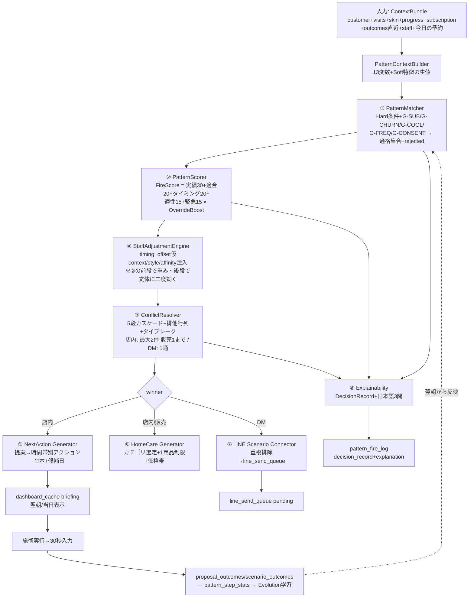

# Riora Proposal Generator Architecture v2.0

**株式会社martylabo / Salon Riora — 最終意思決定エンジン(AI頭脳の完成)**
作成日: 2026-06-11
正典関係: Master Schema v1.0–v1.2 / Event Flow v1.0 / Success Pattern Final Architecture v1.0 / Brain Evolution Architecture v1.0 に準拠。本書は**「顧客状態→最終提案→現場アクション→学習フィードバック」の意思決定全体の唯一の正**。Pattern Engine実装設計v1のProposalGeneratorを完全に置換する(v2.0)。

## 0. 位置づけ

Proposal Generator v2.0 = 8コンポーネントを束ねる**オーケストレータ**。判定部品(Matcher/Scorer/Resolver/Explainability)はFinal Architecture v1.0で確定済み。本書はそれらに**現場出力層(NextAction/HomeCare)とチャネル接続層(LINE Connector)を加え、頭脳を完成**させる。

```
        ┌─────────────── Proposal Generator v2.0 ───────────────┐
入力 →  │ ①Matcher → ②Scorer → ③Resolver → ④StaffAdjust        │
        │      ↓ winner(s)                                      │
        │ ⑤NextAction ←→ ⑥HomeCare    ⑧Explainability(横断)     │
        │      ↓店内              ↓DM                            │
        │ ブリーフィング      ⑦LINE Connector → line_send_queue  │
        └───────────────────────────────────────────────────────┘
              ↓ 実行・結果(outcomes) → Brain学習(Evolution v1.0)
```

---

# 1. 全体フロー(顧客状態→提案・確定版)



# 2. 最終提案選定ロジック(確定)

選定はFinal Architecture v1.0の決定論カスケードを正とし、本書で**最終出力契約**を確定する:

```
FinalProposalSet = {
  inStore: {
    mandatory: FiredProposal | null,    // 1件のみ(スコア1位)。亀山運用の赤表示
    secondary: FiredProposal | null,    // 非販売のみ充当可(G-FREQ精密化)
    candidateDate: DateStr | null,      // rebooking用の次回候補日(⑤が算出)
  },
  dm: QueuedScenario | null,            // ⑦経由でpending起票済みの参照
  explanation: ExplainTexts,            // ⑧
  decisionRecordId: UUID,
}
不変条件(実装でassert):
 ・inStore販売系は合計1件以下 ・subscription存在時 subsc_conditions_met=4
 ・churn>0.7時 販売系ゼロ ・mandatoryのproposalKindとdmのscenarioが同種なら dm=null
```

# 3. ④ Staff Adjustment Engine(統合確定)

3箇所に作用する横断エンジン(従来のResolver内蔵から独立昇格):

| 作用点 | 内容 | データ源 |
|---|---|---|
| 採点前 | timing_offsetの仮context補正(visit_count減算・fire_condition不変) | brain_staff_adjustments |
| 採点中 | w4 StaffAffinity = affinity_score(実測EWMA・なければstyle_affinity prior) | 同+brain_params |
| 出力時 | script_style(evidence/theory/empathy)で⑤⑥の文体合成・亀山=mandatory1件制約・外舘=サブスク資料お渡し型固定 | 同 |

学習との接続: 本エンジンは**読むだけ**。値の更新はStaff Learning Engine(Evolution v1.0)がrevision経由で行う(意思決定と学習の分離)。

# 4. ⑤ NextAction Generator(提案→現場アクション)

winner提案を「いつ・何を・どう言うか」の実行可能アクションに変換する。既存ActionCoachGenerator.tsの後継(置換)。

## 4-1. 時間帯スロット展開

| スロット | 生成されるアクション |
|---|---|
| 施術前(確認) | 前回メモ要約の確認1行+「今日の必須提案」の予告(心の準備) |
| 施術中(トーク) | 提案の布石トーク(ScriptComposer合成・style適用)。実感共有系はここ(鏡・写真・数値提示の指示) |
| 会計前(クロージング) | rebooking台本+**candidateDate**+販売提案の最終文(1件のみ) |
| お見送り後 | 30秒入力のリマインド(チェック4点の事前充填内容) |

## 4-2. candidateDate算出(確定式)

```
candidateDate = last_visit_date + round(avg_cycle)
 補正: ①E型=逆算スケジュールの次マイルストーン固定
       ②パターンのtarget_cycle_daysと実測avg_cycleの乖離>30% → targetへ0.3だけ引き戻し
         (周期が間延びした顧客を理想周期へ緩やかに誘導)
       ③スタッフの空き(bookings照合)で±3日内の最近接営業日に丸め
 出力: 第1候補日+代替2日(「{date}あたりでお席おさえますか?」の変数)
```

## 4-3. 出力契約

```
NextActionPlan = { bookingId, slots: { before: Action[], during: Action[],
  closing: Action[], after: Action[] }, mandatoryKind, candidateDates: DateStr[3] }
Action = { text(合成済台本), kind, evidence1行(なぜ今日か), checklistKey }
```

# 5. ⑥ HomeCare Generator(物販提案の精密化)

homecare系winnerが出た時のみ起動。**SKUは扱わない**(Phase1方針継続・Square連携まではカテゴリ粒度)。

## 5-1. カテゴリ選定ロジック

```
1. タイプ既定カテゴリ: A=洗顔・美容液 / B=洗顔 / C=保湿(1点固定) / D=美容液(ハリ系) / E=主訴準拠
2. 除外: 直近拒否カテゴリ(2来店cooldown) / 購入済みカテゴリ(継続応援はS-R-42のDM側に委譲・
   店内では別カテゴリの「次の一手」のみ)
3. 肌状態補正: dryness>=4 → 保湿を強制1位 / redness>=4 → 低刺激注記を台本に付与
4. 価格帯: 顧客の平均物販単価±50%帯を指定(初回物販は最低価格帯から)
5. 1商品制限(不変)+C型は「私も使っている」共感型固定(empathy)
出力: { category, priceBand, scriptVars: { categoryLabel, reasonOneLine, cautionNote } }
```

## 5-2. 学習接続

retail_categoryの受諾実績がカテゴリ選定の優先順を月次更新(Lv2・セル=タイプ×カテゴリ)。「Bには洗顔より美容液が売れる」が実測で覆ればrevisionが起票される。

# 6. ⑦ LINE Scenario Connector(店内⇄DMの接続)

ScenarioSelectorとの責務分界を確定する:

```
Connector責務(同期・SaveVisitRecord BE1内 / 夜間バッチ内):
 1. winner確定後、店内提案と同種kindのDM候補を抑止
    → scenario_trigger_log blocked_by='superseded_by_instore'
 2. 店内未成立の引き継ぎ: 提案がwas_executed=true & accepted=false で確定した翌日、
    補完シナリオ(S-SB-06〜10等)の発火資格をScenarioSelectorに通知
    (= trigger 'subsc_cond_4_unclosed' 系の正式な発火経路)
 3. O1 Manual Pin顧客はDM販売系を自動停止(店内集中・二重アプローチ防止)
 4. 起票はScenarioSelector経由のみ(Connectorはline_send_queueに直接書かない)
```

# 7. ⑧ Explainability(現場向け最終形)

Final Architecture v1.0 4章を継承し、出力面を確定:

| 受け手 | 形式 | 例 |
|---|---|---|
| スタッフ(ブリーフィング) | 1行×2(なぜ今日か/避けること) | 「4条件が揃った提案最適日です」「商品は1点まで・重ねない」 |
| Manager(fire-log画面) | 3問全文+score_breakdown表 | Q1発火理由/Q2落選理由/Q3決定打 |
| 学習(evidence) | DecisionRecord参照ID | revision根拠への遡及 |
| 顧客向け | **生成しない**(AIの判定を顧客に直接見せない。スタッフの言葉に変換されるのみ) | — |

# 8. パフォーマンス設計(接客中1秒以内の達成構造)

原則: **接客中に計算しない。読むだけにする。**

| 経路 | 実装 | 予算 |
|---|---|---|
| 通常(99%) | 前夜バッチで全予約客のFinalProposalSet生成済 → GET /api/briefing = dashboard_cache 1読取 | <200ms |
| 当日飛込・予約外来店 | SaveVisitRecord前にGET /api/customers/:id が**オンデマンド評価**を起動: ContextBundle 1クエリ+stats(候補セルIN句)1クエリ+メモリ内パイプライン(<50ms・T-10準拠) | <700ms |
| 施術中の再評価(Manager Pin直後等) | 同上+候補マスタはアプリ起動時ロード済(brain_scenarios/patterns/paramsをメモリキャッシュ・version変更時のみ再取得) | <500ms |
| SaveVisitRecord BE1 | 評価はTX1外(レスポンス契約上patternAdvanced等が返せれば同期・1.5s超過時は非同期化可・Event Flow 1章の保留判断) | p95<1.5s |

Supabase最適化の確定: ①リアルタイム経路の集計クエリゼロ(pattern_step_statsマテビュー読取のみ) ②候補・重み・調整値はprocessローカルキャッシュ(TTL=version比較) ③ContextBundleはRPC化(1往復) ④briefing書込はJSONB1行UPSERT。

# 9. Brain学習へのフィードバック(ループの閉鎖)

```
v2.0が書く学習材料(全て既存テーブル・新規なし):
 fire_score / decisive_factor → brain_proposal_outcomes(較正回帰の入力)
 decision_record → pattern_fire_log(落選理由=counterfactual学習の将来資産)
 candidateDate採用率 → bookings.source='in_salon'との突合(周期誘導の効果測定)
 HomeCareカテゴリ受諾 → retail_category実績(5-2)
 superseded_by_instore件数 → チャネル重複の健全性指標(月次レポート)
Evolution v1.0が読む → revision → 承認 → 翌朝、v2.0の入力(候補・重み・調整値)が更新される。
これでRiora OSの 観測→判断→実行→学習→進化 のループが完全に閉じる。
```

# 10. 実装成果物(Claude Code向け・最終ファイル構成)

```
src/engines/proposal/                  ← 新設(pattern/の判定部品をimport)
  ProposalOrchestrator.ts              ← 本書1章フロー。公開API generateFinalProposalSet()
  StaffAdjustmentEngine.ts             ← 3章(pattern/StaffAdjustmentResolver置換)
  NextActionGenerator.ts               ← 4章(既存ActionCoachGenerator置換)
  HomeCareGenerator.ts                 ← 5章
  LineScenarioConnector.ts             ← 6章
src/engines/pattern/                   ← Final Architecture v1.0の5ファイル(確定済)
  PatternMatcher.ts / PatternScorer.ts / ConflictResolver.ts /
  PromotionEngine.ts(→learning/へ移管済) / ExplainabilityEngine.ts
src/engines/learning/                  ← Evolution v1.0の8ファイル(確定済)
```

| テスト | 内容 |
|---|---|
| T-A | 不変条件4本のassert(2章)を破る合成入力で全て検出 |
| T-B | candidateDate: E型逆算/周期間延び0.3引戻し/営業日丸めの数値一致 |
| T-C | HomeCare: C型保湿固定/拒否カテゴリ除外/dryness>=4強制/価格帯境界 |
| T-D | Connector: 同種kind店内優先でDM抑止/未成立翌日の補完発火/Pin顧客DM停止 |
| T-E | 性能: 通常経路200ms・オンデマンド700ms・パイプライン50ms(合成90候補) |
| T-F | E2E: 前夜生成→当日表示→入力→outcomes→月次学習→revision承認→翌朝の提案が変化 |

---

## 11. AI頭脳設計の完成宣言

本書をもって、Riora OSのAI頭脳は以下の全層が確定した:

| 層 | 正典 |
|---|---|
| データ構造 | Master Schema v1.0(+v1.1/v1.2差分) |
| イベント・トランザクション | Event Flow Architecture v1.0 |
| API契約 | API Architecture v1.0 / P0 API Schema v1.0 |
| 判定(資格・採点・競合・説明) | Success Pattern Final Architecture v1.0 |
| 学習・進化・安全 | Brain Evolution Architecture v1.0 |
| **意思決定・現場出力・接続(本書)** | **Proposal Generator Architecture v2.0** |

設計上の到達点: 顧客の状態から1秒以内に説明可能な最適提案を出し、その結果から毎月学び、原則(押し売りしない)だけは何があっても変えない頭脳。実装はタスク分解書のStep順(DB→pattern→learning→proposal→scenario→API)で着手可能。

---
*Riora Proposal Generator Architecture v2.0 — 意思決定エンジンの唯一の正とし、RioraのAI頭脳設計をここに完成とする。*
